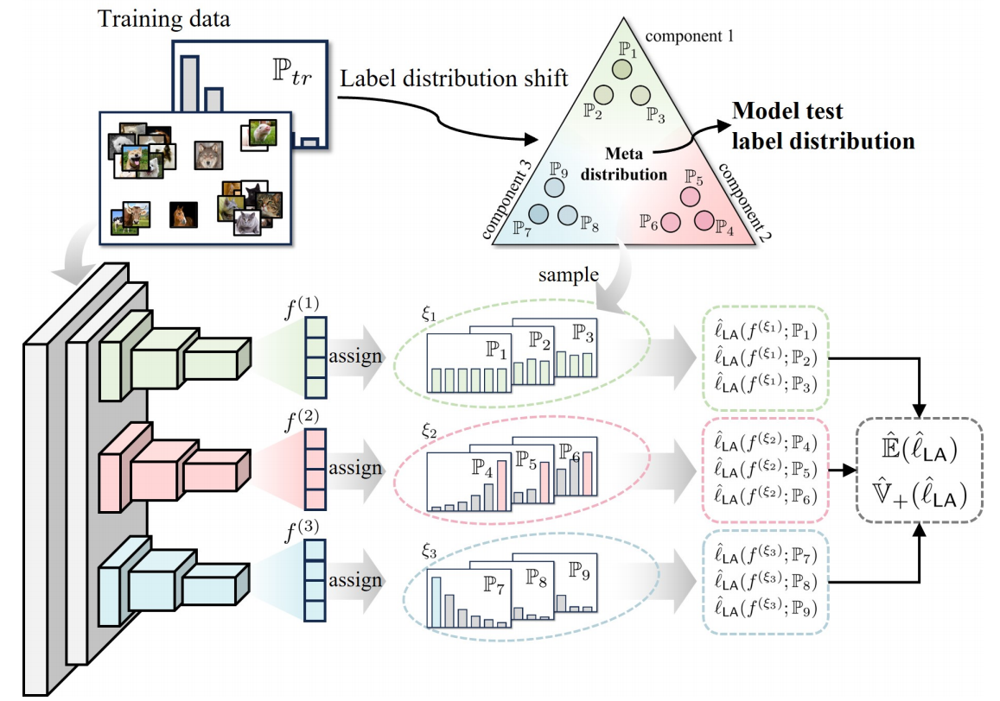

# DirMixE 

This repository is the official code for the paper [Harnessing Hierarchical Label Distribution Variations in Test Agnostic Long-tail Recognition](https://arxiv.org/abs/2405.07780) (ICML 2024).





## Installation

* Clone the repository

```
git clone https://github.com/scongl/DirMixE.git
```

* Install the required libraries

```
pip install -r requirements.txt
```

## Datasets

### Four bechmark datasets 

* Please download these datasets and put them to the /data file.
* ImageNet-LT can be found at [here](https://drive.google.com/drive/u/1/folders/1j7Nkfe6ZhzKFXePHdsseeeGI877Xu1yf).
* iNaturalist data should be the 2018 version from [here](https://github.com/visipedia/inat_comp).
* CIFAR-100 and CIFAR-10 will be downloaded automatically with the dataloader.

```
data
├── CIFAR-10
│   └── cifar-10-batches-py
├── CIFAR-100
│   └── cifar-100-python
├── ImageNet_LT
│   ├── test
│   ├── train
│   └── val
└── iNaturalist
    ├── test2018
    └── train_val2018
```

### Txt files

* We provide txt files for test-agnostic long-tailed recognition for ImageNet-LT, Places-LT and iNaturalist 2018. CIFAR-100 and CIFAR-10 will be generated automatically with the code.
* For iNaturalist 2018, please unzip the iNaturalist_train.zip.

```
data_txt
├── ImageNet_LT
│   ├── ImageNet_LT_backward10.txt
│   ├── ImageNet_LT_backward25.txt
│   ├── ImageNet_LT_backward2.txt
│   ├── ImageNet_LT_backward50.txt
│   ├── ImageNet_LT_backward5.txt
│   ├── ImageNet_LT_forward10.txt
│   ├── ImageNet_LT_forward25.txt
│   ├── ImageNet_LT_forward2.txt
│   ├── ImageNet_LT_forward50.txt
│   ├── ImageNet_LT_forward5.txt
│   ├── ImageNet_LT_test.txt
│   ├── ImageNet_LT_train.txt
│   ├── ImageNet_LT_uniform.txt
│   └── ImageNet_LT_val.txt
└── iNaturalist18
    ├── iNaturalist18_backward2.txt
    ├── iNaturalist18_backward3.txt
    ├── iNaturalist18_forward2.txt
    ├── iNaturalist18_forward3.txt
    ├── iNaturalist18_train.txt
    ├── iNaturalist18_uniform.txt
    └── iNaturalist18_val.txt
```

## Script

### CIFAR10-LT 

#### Training

* To train the DirMixE model, run this command:

```
python train.py -c configs/train/cifar10.json 
```

#### Evaluate

* To evaluate DirMixE under ours setting, run this command:

``` 
python test_train_cifar_dirmixe.py -c configs/test/test_cifar10.json -r checkpoint_path
```

- To evaluate DirMixE under sade's setting, run this command:

```
python test_train_cifar_sade.py -c configs/test/test_cifar10.json -r checkpoint_path
```

### CIFAR100-LT

#### Training

* To train the DirMixE model, run this command:

```
python train.py -c configs/train/cifar100.json 
```

#### Evaluate

* To evaluate DirMixE under ours setting, run this command:

``` 
python test_train_cifar_dirmixe.py -c configs/test/test_cifar100.json -r checkpoint_path
```

- To evaluate DirMixE under sade's setting, run this command:

```
python test_train_cifar_sade.py -c configs/test/test_cifar100.json -r checkpoint_path
```

### ImageNet-LT

#### Training

* To train the DirMixE model, run this command:

```
python train.py -c configs/train/imagenet.json 
```

#### Evaluate

* To evaluate DirMixE under ours setting, run this command:

``` 
python test_train_cifar_dirmixe.py -c configs/test/test_imagenet.json -r checkpoint_path
```

- To evaluate DirMixE under sade's setting, run this command:

```
python test_train_cifar_sade.py -c configs/test/test_imagenet.json -r checkpoint_path
```

### iNaturalist

#### Training

* To train the DirMixE model, run this command:

```
python train.py -c configs/train/inaturalist.json
```

#### Evaluate

* To evaluate DirMixE under ours setting, run this command:

``` 
python test_train_cifar_dirmixe.py -c configs/test/test_inaturalist.json -r checkpoint_path
```

- To evaluate DirMixE under sade's setting, run this command:

```
python test_train_cifar_sade.py -c configs/test/test_inaturalist.json -r checkpoint_path
```

## Citation

If you find our work inspiring or use our codebase in your research, please cite our work.

```
@inproceedings{yang2024harnessing,
    title={Harnessing Hierarchical Label Distribution Variations in Test Agnostic Long-tail Recognition}, 
    author={Zhiyong Yang and Qianqian Xu and Zitai Wang and Sicong Li and Boyu Han and Shilong Bao and Xiaochun Cao and Qingming Huang},
    booktitle={International Conference on Machine Learning},
    year={2024}
}
```

## Acknowledgements

Our codes are based on the repository [SADE](https://github.com/Vanint/SADE-AgnosticLT).